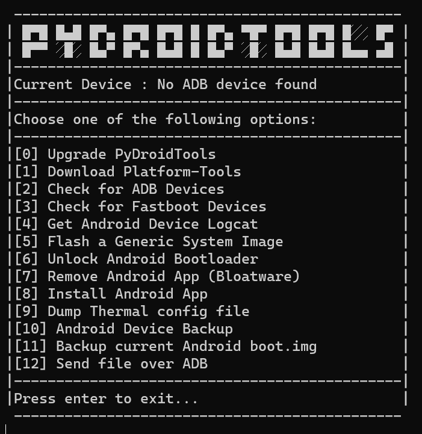

```
█▀█ █▄█ █▀▄ █▀█ █▀█ █ █▀▄ ▀█▀ █▀█ █▀█ █░░ █▀
█▀▀ ░█░ █▄▀ █▀▄ █▄█ █ █▄▀ ░█░ █▄█ █▄█ █▄▄ ▄█
  ```
  >Simple Python program powered by Android Platform-Tools 
  <br/>


# Screenshoots


# System Requirements
• Recent <a href="https://www.python.org/downloads/release/python-3104/">Python 3 version</a><br/>
• <a href="https://github.com/git-for-windows/git/releases/latest">Git for Windows</a>

# Installation
To get started, paste the following command into your Windows cmd/PowerShell
```
git clone https://github.com/daviiid99/PyDroidTools PyDroidTools
cd PyDroidTools
python Main.py
```
