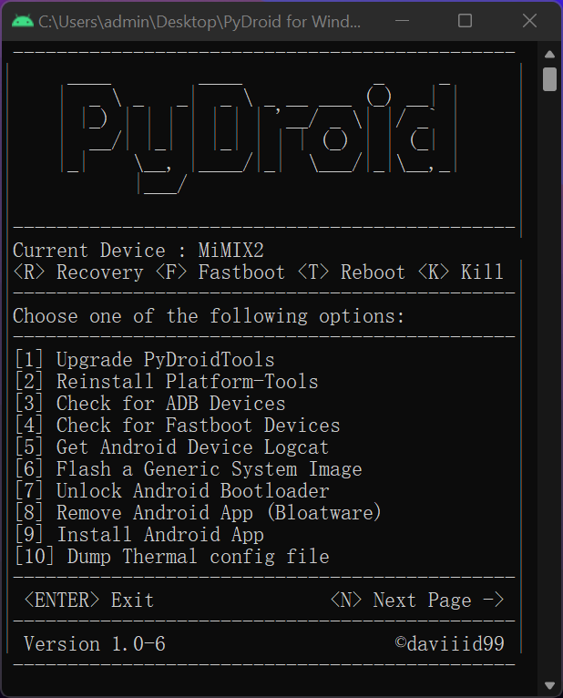

```
█▀█ █▄█ █▀▄ █▀█ █▀█ █ █▀▄ 
█▀▀ ░█░ █▄▀ █▀▄ █▄█ █ █▄▀
  ```
  >Simple Python program powered by Android Platform-Tools 
  <br/>


# Screenshots


# System Requirements
• <a href="https://www.python.org/downloads/">Python 3.10 version or newer</a><br/>

# Installation
• Command Line Version:

To get started, paste the following command into your Windows cmd/PowerShell
```
git clone -b Linux https://github.com/daviiid99/PyDroid PyDroid
cd PyDroid
python3 Main.py
```
<br/>
